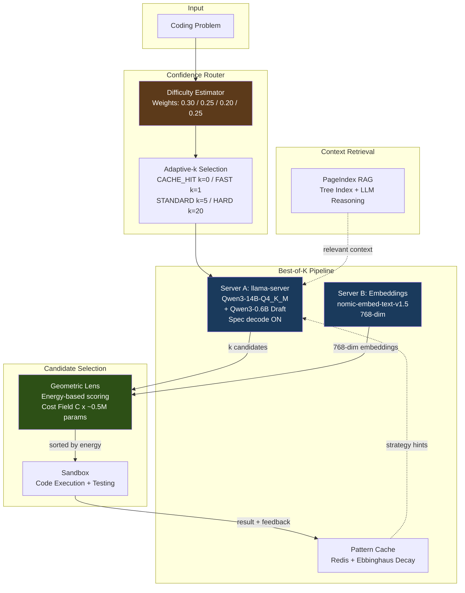

# A.T.L.A.S

**Adaptive Test-time Learning and Autonomous Specialization**

A.T.L.A.S achieves 36-41% LiveCodeBench pass@1 with a frozen 14B model on a single consumer GPU through intelligent test-time compute allocation. No fine-tuning, no API calls, no cloud -- just a $500 GPU and smart inference.

---

## Benchmark Results

> Run ID: `v2_run_20260217_125310` | Hardware: RTX 5060 Ti 16GB | Throughput: 109 tasks/hr

| Benchmark | Score | Tasks | Method |
|-----------|-------|-------|--------|
| **LiveCodeBench v5** | **36-41% pass@1** | 599 | k=3, Geometric Lens selection, 4 epochs |
| **GPQA Diamond** | **47.0%** | 198 | k=5, multiple-choice knowledge reasoning |
| **SciCode** | **14.7%** (sub-problems) | 341 | k=1, cross-domain scientific coding |

Single run, not averaged. LCB range reflects epoch 0-3 of Lens retraining, not a confidence interval.

<details>
<summary><b>Lens learning curve (LiveCodeBench, k=3)</b></summary>

| Epoch | Tasks | Pass Rate | First-Pick Accuracy | Energy Gap |
|-------|-------|-----------|---------------------|------------|
| 0 (baseline, no Lens) | 100 | 36.0% | n/a | n/a |
| 1 (1st retrain) | 200 | 38.0% | 82.9% | 5.3 |
| 2 (2nd retrain) | 200 | 35.5% | 78.9% | 11.5 |
| 3 (3rd retrain) | 99 | 41.4% | 78.0% | 11.3 |

First-pick accuracy = how often the Lens's lowest-energy candidate actually passes. The energy gap between pass and fail candidates doubled after retraining (5.3 to 11.3), showing the Lens learned to separate passing from failing code. Val AUC reached 0.968 at epoch 3.

**Note**: The V2.5 ablation study found that under 768-dim nomic embeddings, C(x) was statistically indistinguishable from random selection (37.7% vs 37.1%). **V2.5.1 confirmed this was an embedding source limitation**, not an architecture failure. With Qwen3-14B self-embeddings (5120-dim), C(x) selects correctly **87.8% of the time** on mixed-result tasks vs 48.3% random (**+39.5pp**, p < 0.000001). The Lens requires the model's own internal representations to discriminate candidates.

> **V2.5.1 Result (2026-02-23)**: Self-embeddings restore full discrimination. C(x) is a verified candidate verifier AND difficulty router. G(x) metric tensor contributes zero value and will be removed. See [V2_5_ABLATION_STUDY.md](docs/V2_5_ABLATION_STUDY.md) for the full confirmation ablation report.

</details>

<details>
<summary><b>V2.5 Ablation Study + V2.5.1 Confirmation</b></summary>

A systematic ablation (2026-02-21) tested whether the Geometric Lens C(x) energy scoring provides real candidate selection value beyond diversity. Under 768-dim nomic embeddings, Lens scoring was statistically indistinguishable from random selection (37.7% vs 37.1%, +0.6pp within 3.4pp seed variance).

> **✅ V2.5.1 CONFIRMED (2026-02-23)**: This result was caused by the embedding source switch, not the Lens architecture. With Qwen3-14B self-embeddings (5120-dim), **C(x) selects correctly 87.8% of the time** on mixed-result tasks vs 48.3% random (**+39.5pp**, p < 0.000001). Reverse energy selects only 4.3%, proving a strong directional signal. The Lens is a verified candidate discriminator — it just needs the model's own internal representations.

| Metric | V2.5 (nomic 768-dim) | V2.5.1 (self 5120-dim) |
|--------|---------------------|------------------------|
| Selection accuracy (mixed tasks) | 37.7% | **87.8%** |
| Selection - Random delta | +0.6pp | **+39.5pp** |
| Energy separation (PASS - FAIL) | ~3.0 | **21.75** |
| G(x) metric tensor value | dormant | **zero** (0.0pp at any alpha) |

The V2.5 study also discovered that llama.cpp's `--embeddings` flag silently breaks speculative decoding (forcing n_batch=512). This led to a two-server sidecar architecture: generation with spec decode (~100 tok/s) on the main server, embeddings via nomic sidecar (~300 MiB VRAM). C(x) energy is confirmed as both a **candidate verifier** (87.8% selection accuracy) and **difficulty router** (Q1=100% solvable, Q4=0.3%).

Full results: [V2_5_ABLATION_STUDY.md](docs/V2_5_ABLATION_STUDY.md) | Architecture change: [V2_TO_V2_5_MIGRATION.md](docs/V2_TO_V2_5_MIGRATION.md)

</details>

---

## Architecture



A.T.L.A.S runs entirely on K3s with a single GPU. The **Confidence Router** estimates task difficulty from 4 signals and selects how many candidates to generate (k=0 to k=20). The **Best-of-K Pipeline** generates candidates via speculative decoding (~100 tok/s), scores them with the **Geometric Lens** energy field, and tests them in an isolated **Sandbox** with early exit on first pass. A **Pattern Cache** with Ebbinghaus memory decay stores successful strategies for future routing.

The system also includes an optional **MaaS layer** (API Portal + LLM Proxy) for multi-user access with JWT auth, API key management, and rate limiting.

Full architecture details: **[docs/ARCHITECTURE.md](docs/ARCHITECTURE.md)**

---

## The Geometric Lens

The Lens implements an ARM-EBM (Adaptive Riemannian Metric / Energy-Based Model) duality. A cost field C(x) maps code embeddings to scalar energy: passing code concentrates near energy 2.99, failing code near 24.73 (under self-embeddings; V2.5.1 results).

| | |
|---|---|
| **Candidate verifier** | With 5120-dim self-embeddings, C(x) selects the passing candidate **87.8% of the time** on mixed-result tasks (+39.5pp vs random, p < 0.000001). Val AUC 0.9934. Reverse energy selects only 4.3%, proving a strong directional signal. |
| **Difficulty router** | C(x) energy perfectly stratifies task difficulty: Q1 (low energy) = 100% solvable, Q4 (high energy) = 0.3%. Dual use as verifier + router validated. |
| **Embedding source matters** | Under 768-dim nomic embeddings (V2.5), C(x) ≈ random (+0.6pp). V2.5.1 confirmed this was an embedding source limitation — the Lens requires the model's own internal representations. |

G(x) metric tensor contributes zero value at any correction strength and will be removed or redesigned for V3 (5.2M parameters, 0.0pp net contribution).

---

## Quick Start

```bash
# 1. Clone
git clone https://github.com/itigges22/A.T.L.A.S.git && cd A.T.L.A.S

# 2. Configure
cp A.T.L.A.S.conf.example A.T.L.A.S.conf
# Edit A.T.L.A.S.conf: set MODEL_PATH, DATA_DIR, GPU device

# 3. Install
sudo ./scripts/install.sh

# 4. Verify
./scripts/verify-install.sh

# 5. Run benchmark
benchmark/run_v2_benchmark.sh
```

See **[docs/SETUP.md](docs/SETUP.md)** for full installation instructions.

---

## Hardware Requirements

| Resource | Minimum | Tested |
|----------|---------|--------|
| Python | 3.10+ | 3.11 |
| GPU VRAM | 16 GB | RTX 5060 Ti 16 GB |
| System RAM | 14 GB | 16 GB |
| Storage | ~20 GB | 150 GB SSD |
| OS | RHEL 9 / Ubuntu 24 | RHEL 9 (Proxmox VM) |

---

## Project Structure

```
api-portal/      API key management portal (JWT auth, web UI)
benchmark/       V2 benchmark suite (LCB, GPQA, SciCode, Custom, IFBench)
docs/            Architecture, setup, configuration, troubleshooting
manifests/       K3s deployment manifests
rag-api/         Core API: Geometric Lens, router, RAG, cache
llama-server/    llama.cpp server container
A.T.L.A.S/sandbox/   Isolated code execution environment
scripts/         Installation and management scripts
tests/           Test suite
```

---

## Documentation

| Document | Description |
|----------|-------------|
| **[ARCHITECTURE.md](docs/ARCHITECTURE.md)** | Full system architecture, component deep-dives, data flows |
| **[V2_5_ABLATION_STUDY.md](docs/V2_5_ABLATION_STUDY.md)** | Geometric Lens ablation results and analysis |
| **[V2_TO_V2_5_MIGRATION.md](docs/V2_TO_V2_5_MIGRATION.md)** | Two-server sidecar migration details |
| **[SETUP.md](docs/SETUP.md)** | Installation and deployment guide |
| **[CONFIGURATION.md](docs/CONFIGURATION.md)** | Configuration reference |
| **[API.md](docs/API.md)** | API endpoint documentation |
| **[TROUBLESHOOTING.md](docs/TROUBLESHOOTING.md)** | Common issues and solutions |

---

## Roadmap

### V2.5.1 — Embedding Source Hypothesis (CONFIRMED, 2026-02-23)

V2.5.1 confirmed that the V2.5 finding (Lens ≈ random) was caused by the embedding source switch from self-embeddings to nomic, not a Lens architecture failure.

- **Result**: C(x) selects correctly **87.8%** on mixed tasks (+39.5pp vs random, p < 0.000001) with 5120-dim self-embeddings
- **G(x)**: Zero value at any alpha. Remove or fundamentally redesign.
- **Next step**: Restore self-embeddings in production while maintaining spec decode throughput

### V3 — Performance Target

V3 targets 70%+ LiveCodeBench through C(x) candidate verification (87.8% accuracy), test synthesis for the remaining 12.2%, and difficulty-adaptive routing. The core thesis: a frozen model with the right selection and routing infrastructure can match models 10x its size. V2.5.1 resolved the blocking dependency — the Lens is the verifier, and V3 Phase 4 builds a test synthesis module for cases beyond C(x)'s ceiling.

---

## License

Licensed under the A.T.L.A.S Source Available License v1.0 -- see [LICENSE](LICENSE).
